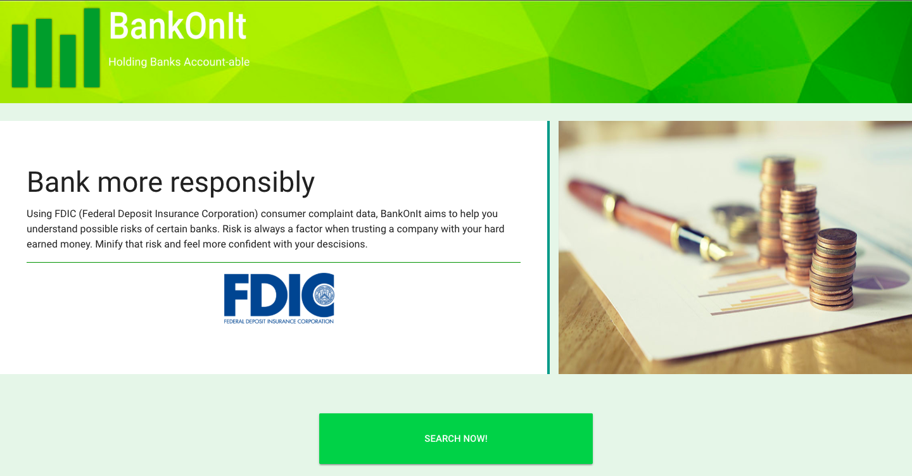

# BankOnIt

## Live Site
#### https://bankonit-app.firebaseapp.com/#/

## About
Banking has always had risk involved, and that seems to be increasingly so.  BankOnIt aims to reduce that risk by taking data from the FDIC (Federal Deposit Insurance Company) database and displaying that data out for consumers in an easy to understand way.  Users can go and search by their state, or for a more narrow search by zip code, and see all formal FDIC consumer complaints that have been filed.  Users can also get some informational data visualization to see which banks and financial products pose the most risk in their area.

## Build Setup

### Install dependencies
`npm install`

### Serve with hot reload at localhost:8080
`npm run dev`

## Technology Used
### Frontend
- Vue
- Vuetify
- Vue-charts wrapper for Charts.js
- Firebase

### Backend
- MongoDB
- Monk
- Express
- CSVtoJSON
- Heroku

## Author
### [Hayley Zulkoski](https://github.com/hayz999)
##### https://www.linkedin.com/in/hayley-zulkoski-webdev/

© BankOnIt, 2018

